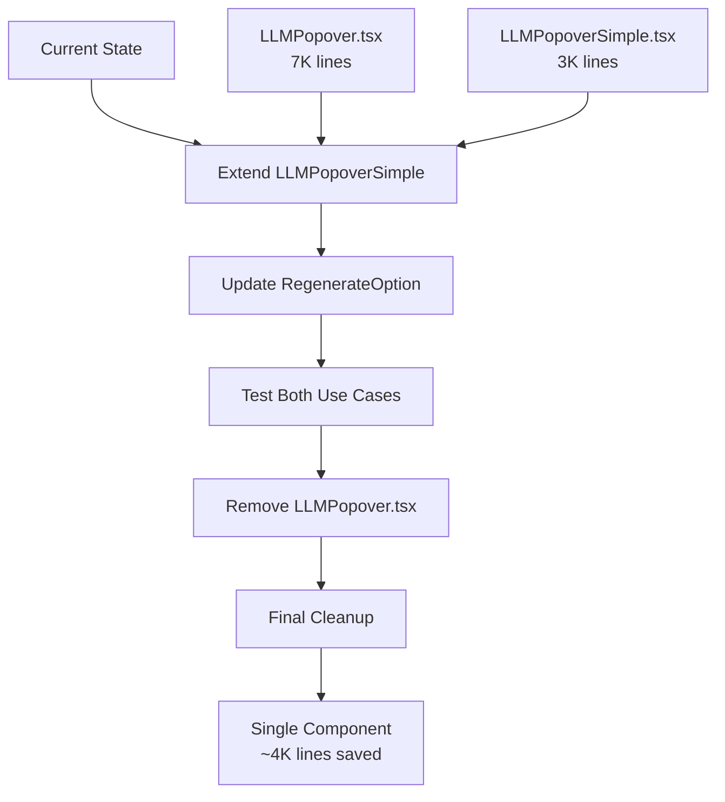

# 1.5 Extend LLMPopoverSimple for Codebase Consolidation

**Date:** 2025-08-27  
**Status:** Planning  
**Priority:** Medium  
**Methodology:** Test-Driven Development (TDD)

## Overview

Consolidate two LLM popover components (`LLMPopover.tsx` and `LLMPopoverSimple.tsx`) into a single, extensible component to reduce code duplication and improve maintainability. This will eliminate ~4K lines of duplicate code while maintaining full backward compatibility.

## Problem Statement

**Current State:**
- `LLMPopover.tsx` (7K+ lines): Complex component for RegenerateOption with custom triggers, callbacks, temperature control
- `LLMPopoverSimple.tsx` (3K lines): Simple component for ChatInputBar with fixed trigger, basic model selection
- **Code Duplication:** ~60% overlap in model selection logic, UI rendering, state management
- **Maintenance Burden:** Two separate components to maintain, test, and debug

**Root Cause Analysis:**
1. RegenerateOption requires custom trigger (refresh icon) and onSelect callback
2. ChatInputBar needs simple, fixed trigger with default behavior
3. No shared base component or extensible interface

## Success Criteria

**Functional Requirements:**
- ✅ ChatInputBar continues working with existing behavior (no regression)
- ✅ RegenerateOption gets equivalent functionality with extended props
- ✅ Temperature slider support for advanced use cases
- ✅ Custom trigger support for different UI contexts
- ✅ Callback support for custom selection handling

**Technical Requirements:**
- ✅ Backward compatibility: existing `LLMPopoverSimple` usage unchanged
- ✅ Type safety: full TypeScript support for all props
- ✅ Performance: no performance degradation
- ✅ Test coverage: ≥90% coverage for extended functionality
- ✅ Bundle size: net reduction of ~4K lines

**Quality Gates:**
- ✅ All existing tests pass
- ✅ New functionality fully tested
- ✅ No TypeScript errors
- ✅ No runtime errors in development
- ✅ UI behavior identical to current implementation

## Technical Architecture

### Component Interface Design

```typescript
interface ExtendedLLMPopoverProps {
  // Core props (existing)
  llmProviders: LLMProviderDescriptor[];
  llmManager: LlmManager;
  
  // Extended props (new, all optional)
  trigger?: React.ReactElement;                    // Custom trigger component
  onSelect?: (value: string) => void;             // Custom selection handler
  currentModelName?: string;                      // Model override for display
  currentAssistant?: MinimalPersonaSnapshot;      // Assistant context
  requiresImageGeneration?: boolean;              // Image generation filtering
  showTemperature?: boolean;                      // Temperature slider toggle
  disabled?: boolean;                             // Disable popover
}
```

### Backward Compatibility Strategy

```typescript
// Phase 1: Existing usage continues to work
<LLMPopoverSimple 
  llmProviders={providers} 
  llmManager={manager} 
  // No other props needed - uses defaults
/>

// Phase 2: Extended usage with new features
<LLMPopoverSimple
  llmProviders={providers}
  llmManager={manager}
  trigger={<RefreshButton />}
  onSelect={handleRegenerate}
  currentModelName={overriddenModel}
  showTemperature={true}
/>
```

### Migration Path



## Implementation Plan

### Phase 1: Extend Interface & Implementation (TDD)

**Files to Modify:**
- `src/app/chat/input/LLMPopoverSimple.tsx`
- `src/app/chat/input/LLMPopover.tsx` (reference for features)

**Changes:**
1. **Interface Extension:**
   ```typescript
   interface LLMPopoverSimpleProps {
     llmProviders: LLMProviderDescriptor[];
     llmManager: LlmManager;
     trigger?: React.ReactElement;
     onSelect?: (value: string) => void;
     currentModelName?: string;
     currentAssistant?: MinimalPersonaSnapshot;
     requiresImageGeneration?: boolean;
     showTemperature?: boolean;
     disabled?: boolean;
   }
   ```

2. **Default Behavior Preservation:**
   ```typescript
   const defaultTrigger = (
     <button className="...existing classes...">
       {/* Existing trigger JSX */}
     </button>
   );

   const handleSelection = onSelect || ((option) => {
     llmManager.updateCurrentLlm({...});
   });
   ```

3. **Temperature Slider Integration:**
   ```typescript
   {showTemperature && (
     <div className="px-3 py-2 border-t">
       <TemperatureSlider 
         value={llmManager.temperature}
         onChange={llmManager.setTemperature}
       />
     </div>
   )}
   ```

### Phase 2: Update RegenerateOption Integration

**Files to Modify:**
- `src/app/chat/RegenerateOption.tsx`

**Changes:**
1. **Import Update:**
   ```typescript
   // FROM: import LLMPopover from "./input/LLMPopover";
   // TO:   import LLMPopoverSimple from "./input/LLMPopoverSimple";
   ```

2. **Props Mapping:**
   ```typescript
   <LLMPopoverSimple
     llmProviders={llmProviders}
     llmManager={llmManager}
     trigger={customRefreshTrigger}
     onSelect={handleRegenerateWithModel}
     currentModelName={overriddenModel}
     currentAssistant={selectedAssistant}
     requiresImageGeneration={false}
   />
   ```

### Phase 3: Testing & Validation

**Test Scenarios:**
1. **Backward Compatibility Tests:**
   - ChatInputBar continues working identically
   - No visual regression in chat input area
   - Model selection behavior unchanged

2. **Extended Functionality Tests:**
   - RegenerateOption shows refresh trigger
   - Custom onSelect callback fires correctly
   - Temperature slider appears when enabled
   - Model filtering works with requiresImageGeneration

3. **Integration Tests:**
   - Chat input → model selection → chat continues
   - Message hover → regenerate button → model selection → regeneration
   - Assistant context switching affects available models

### Phase 4: Cleanup & Optimization

**Files to Remove:**
- `src/app/chat/input/LLMPopover.tsx`
- `tests/unit/chat/LLMPopover.test.tsx`

**Bundle Analysis:**
- Measure before/after bundle size
- Verify ~4K line reduction achieved
- Confirm no performance regression

## Test-Driven Development Implementation

### Phase 1: Test Scripts (Write Tests First)

**1.1 Backward Compatibility Test Suite**
```typescript
// tests/unit/chat/LLMPopoverSimple.backward-compatibility.test.tsx
describe('LLMPopoverSimple Backward Compatibility', () => {
  it('should work with minimal props like before', () => {
    // Test existing ChatInputBar usage
  });
  
  it('should render default trigger when no trigger prop provided', () => {
    // Test default trigger rendering
  });
  
  it('should call llmManager.updateCurrentLlm when no onSelect provided', () => {
    // Test default selection behavior
  });
});
```

**1.2 Extended Functionality Test Suite**
```typescript
// tests/unit/chat/LLMPopoverSimple.extended.test.tsx
describe('LLMPopoverSimple Extended Features', () => {
  it('should render custom trigger when provided', () => {
    // Test custom trigger prop
  });
  
  it('should call custom onSelect when provided', () => {
    // Test custom callback
  });
  
  it('should show temperature slider when showTemperature=true', () => {
    // Test temperature slider
  });
  
  it('should filter models based on requiresImageGeneration', () => {
    // Test image generation filtering
  });
});
```

**1.3 Integration Test Suite**
```typescript
// tests/e2e/chat/llm_popover_consolidation.spec.ts
describe('LLM Popover Consolidation E2E', () => {
  it('should maintain chat input functionality', async () => {
    // Test complete chat input flow
  });
  
  it('should maintain regenerate functionality', async () => {
    // Test complete regenerate flow
  });
  
  it('should allow model switching in both contexts', async () => {
    // Test model switching works everywhere
  });
});
```

### Phase 2: Implementation (Make Tests Pass)

**2.1 Serena MCP Usage Strategy**
```bash
# Use Serena for intelligent code analysis and modification
# Focus on understanding existing patterns before implementing
# Use symbol-based editing for precise modifications
```

**2.2 Implementation Steps:**
1. Use Serena to analyze current `LLMPopover.tsx` structure
2. Extract reusable logic and components
3. Extend `LLMPopoverSimple.tsx` with new props and logic
4. Update RegenerateOption.tsx to use extended component
5. Run tests to ensure implementation correctness

### Phase 3: Test Execution & Validation

**3.1 Unit Test Execution:**
```bash
npm run test -- LLMPopoverSimple.test.tsx
npm run test -- RegenerateOption.test.tsx
```

**3.2 E2E Test Execution:**
```bash
npx playwright test tests/e2e/chat/llm_popover_consolidation.spec.ts
```

**3.3 Manual Testing Checklist:**
- [ ] Chat input model selection works
- [ ] Regenerate button appears on message hover
- [ ] Regenerate model selection works
- [ ] Temperature slider appears when enabled
- [ ] No console errors in browser
- [ ] Visual regression check

### Phase 4: Improvement Iterations

**4.1 Test Failure Response:**
- Analyze failing tests to understand root cause
- Fix implementation without breaking existing functionality
- Re-run test suite until all tests pass
- Document any edge cases discovered

**4.2 Performance Validation:**
- Bundle size comparison
- Runtime performance benchmarking
- Memory usage validation
- User interaction responsiveness

## Risk Assessment & Mitigation

### High Risk (Probability: Low, Impact: High)
**Risk:** Breaking existing ChatInputBar functionality
**Mitigation:** 
- Extensive backward compatibility testing
- Feature flags for gradual rollout
- Immediate rollback plan available

### Medium Risk (Probability: Medium, Impact: Medium)
**Risk:** RegenerateOption behavior changes
**Mitigation:**
- Side-by-side comparison testing
- Pixel-perfect UI validation
- User acceptance testing

### Low Risk (Probability: High, Impact: Low)
**Risk:** TypeScript compilation issues
**Mitigation:**
- Incremental type updates
- Strict type checking enabled
- Pre-commit validation hooks

## Rollback Plan

**Immediate Rollback (If Critical Issues Found):**
1. Revert RegenerateOption.tsx to use LLMPopover
2. Revert LLMPopoverSimple.tsx to original state
3. Restore deleted LLMPopover.tsx from git
4. Run full test suite to confirm stability

**Partial Rollback (If Some Features Problematic):**
1. Keep extended LLMPopoverSimple for ChatInputBar
2. Revert RegenerateOption to use original LLMPopover
3. Fix issues and re-attempt migration

## Definition of Done

- [ ] All existing functionality preserved (0 regressions)
- [ ] Extended functionality working as specified
- [ ] Test coverage ≥90% for modified components
- [ ] Bundle size reduced by ~4K lines
- [ ] Documentation updated
- [ ] Code review completed
- [ ] QA sign-off received
- [ ] Production deployment successful

## Timeline

**Phase 1 (Test Writing):** 1 day
- Write comprehensive test suite
- Set up testing infrastructure
- Define acceptance criteria

**Phase 2 (Implementation):** 2 days  
- Extend LLMPopoverSimple with Serena MCP
- Update RegenerateOption integration
- Fix initial test failures

**Phase 3 (Testing & Refinement):** 1 day
- Execute full test suite
- Manual testing and validation
- Performance benchmarking

**Phase 4 (Cleanup & Documentation):** 0.5 day
- Remove old files
- Update documentation
- Final code review

**Total Estimated Time:** 4.5 days

## Tools & Dependencies

**Development Tools:**
- Serena MCP for intelligent code analysis and modification
- Jest for unit testing
- Playwright for E2E testing
- React Testing Library for component testing

**Key Dependencies:**
- React 18+
- TypeScript 5+
- Radix UI components
- Tailwind CSS

**Code Quality Tools:**
- ESLint for code linting
- Prettier for code formatting
- TypeScript compiler for type checking

## Notes

- This consolidation will significantly improve codebase maintainability
- The TDD approach ensures high confidence in the refactoring
- Serena MCP will be crucial for understanding complex component interactions
- Backward compatibility is the highest priority throughout implementation
- Bundle size reduction is a significant benefit but secondary to functionality

---

**Next Steps:**
1. Review and approve this plan
2. Set up feature branch for implementation
3. Begin Phase 1: Test script development with TDD approach
4. Use Serena MCP for intelligent code analysis and implementation